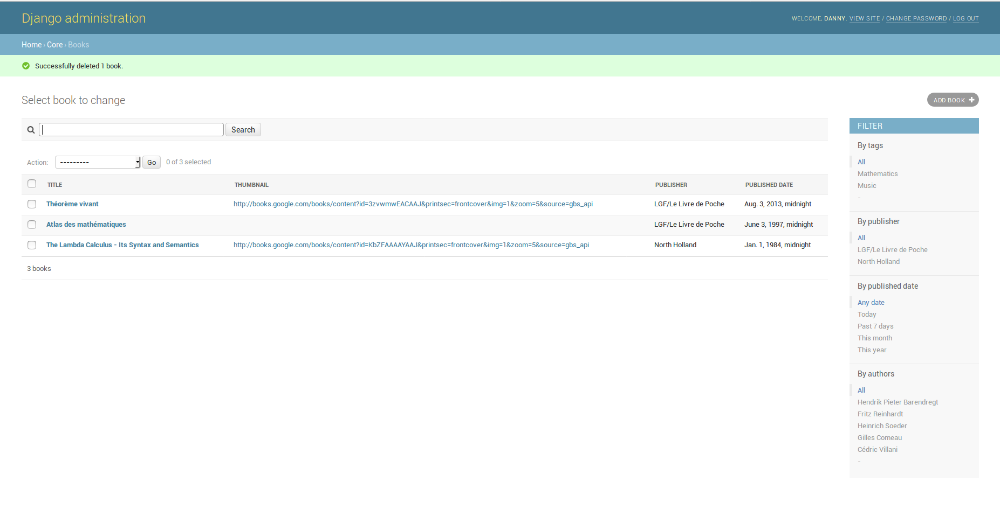
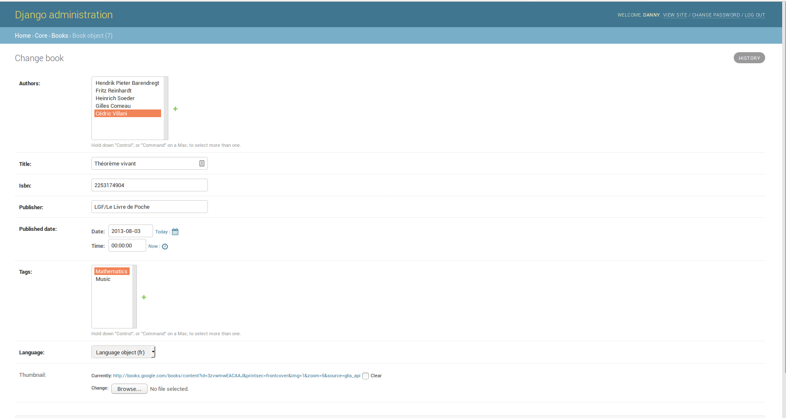
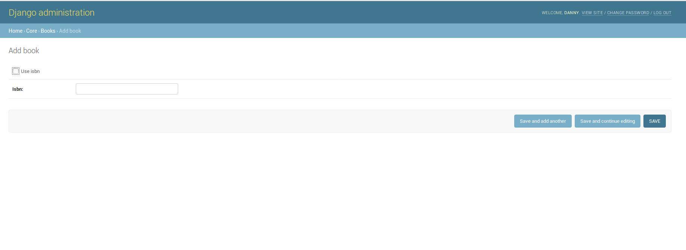
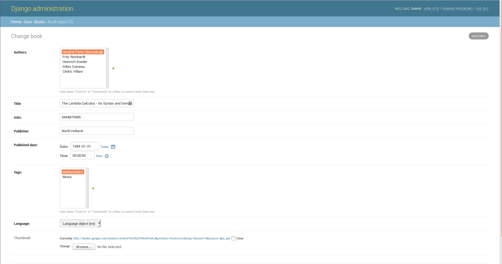

Manage your library easily.
=================================






## Run.

*Pipenv* is used.

```
pipenv install
python manage.py migrate
python manage.py createsuperuser # to have access to the admin page.
python manage.py runserver
```
